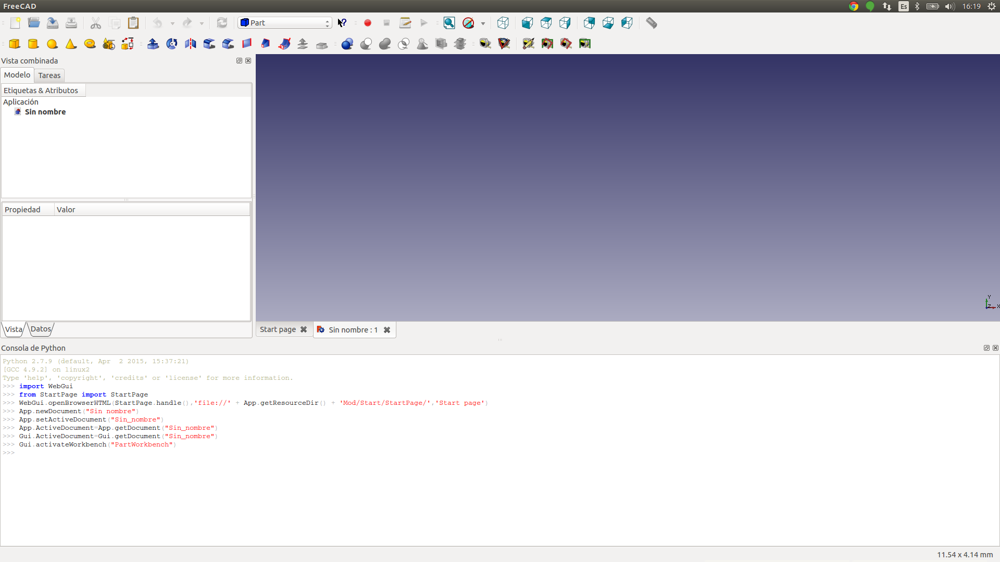
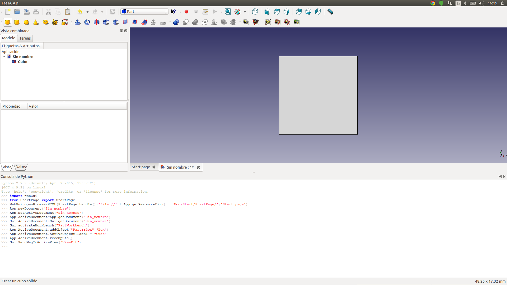
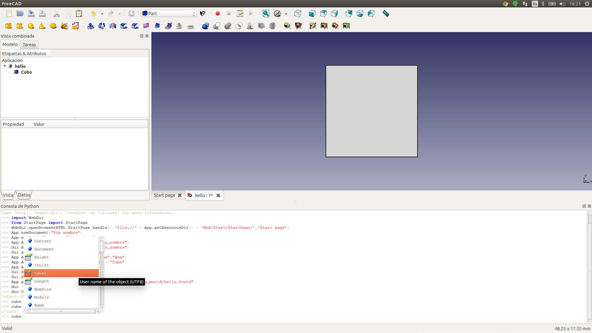
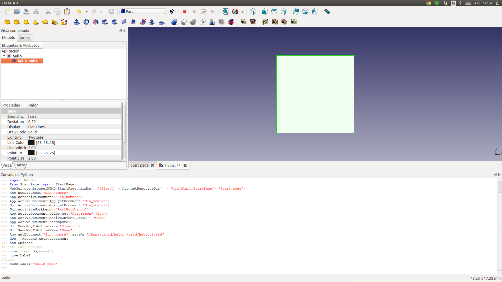
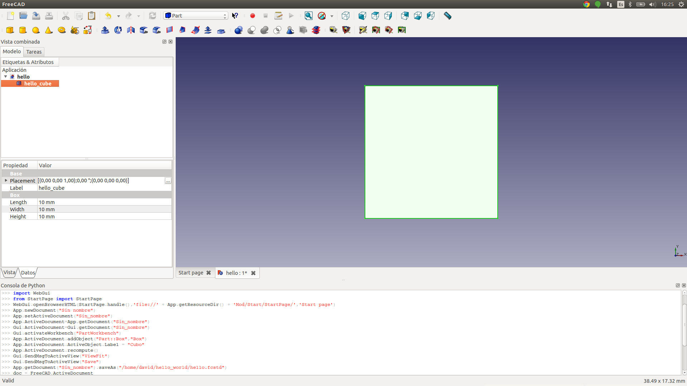

Getting started
===============

.. todo::

	TODO

Create a folder with the name `hello_world` and save all the following files inside.

Open FreeCAD and create a new document.

Create a cube.

Save the document as `hello.fcstd`.

.. image:: ./_static/img/gs_003.png

You can navigate the Cube info, for example, change the Cube Label to `"hello_cube"`.

You can see all the editable paramaterers in the python terminal.

Save the project.

Create a machine script `hello_world.py`.

.. code-block:: python

	import sys
	FREECADPATH = '/usr/lib/freecad/lib/'
	sys.path.append(FREECADPATH)
	import FreeCAD
	import Mesh
	import os

	def machinebuilder(length, width, height, file_path):

	    document = os.path.abspath("hello.fcstd")
	    #-- Open document
	    doc = FreeCAD.openDocument(document)

	    #-- Edit parameters
	    cube = None
	    for figure in doc.Objects:
	        if figure.Label == 'hello_cube':
	            cube = figure
	    if cube:
	        cube.Length = length
	        cube.Height = height
	        cube.Width = width
	    	doc.recompute()

	   	 #-- Export the file
	    	Mesh.export([cube], file_path)

and a machinefile.txt

.. code-block:: text

	[doc]
	-title-
	Hello World Cube
	-description-
	A simple CUbe
	-images_url-
	http://d33y93cfm0wb4z.cloudfront.net/coloringimages/3D_shapes/444x271/cube_447x271.jpg
	[inputs]
	int(length=50)
	float(width=50)
	int(height=50)

Now, you should have a folder tree like the following.

.. code-block:: bash

	hello_world/
	├── hello.fcstd
	├── hello_world.py
	└── machinefile.txt

Create a hello_world.zip file with all the files and `Upload` the machine.

.. toctree::
   :maxdepth: 3

   gettingstarted/usemachine
   gettingstarted/firstmachine
   gettingstarted/uploadmachine
   gettingstarted/updatemachine